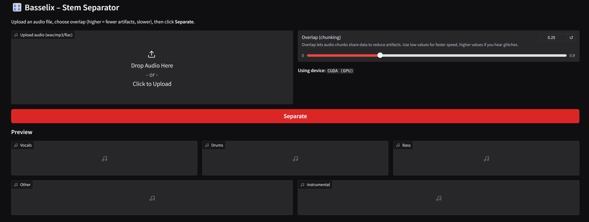
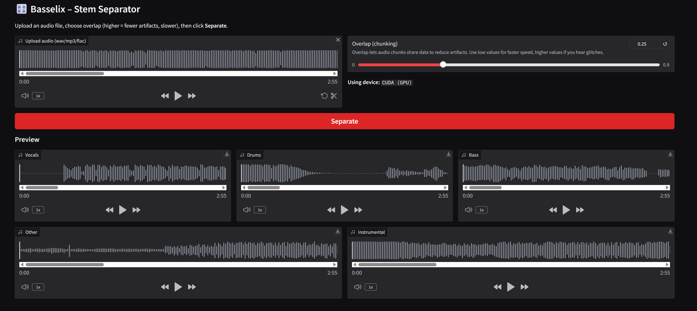

# ️Basselix

### GPU-accelerated music source separation tool


---

## ✨ Features

* **GPU acceleration** with PyTorch (CUDA support)
* Supports the following formats: **MP3, WAV, FLAC**
* **Gradio interface** -> no coding required
* Interactive **waveform player**
* **Downloadable stems** (vocals, drums, bass, other)
* Ready‑to‑use with **Docker**

---

## 🛠 Tech Stack

[](https://www.gradio.app/)
[](https://pytorch.org/)
[](https://www.python.org/)
[](https://www.docker.com/)

* **ML Engine**: Demucs + PyTorch
* **Web App**: Gradio
* **Audio Processing**: Librosa, SoundFile
* **Containerization**: Docker

---

## 🎮 How It Works

1. Upload a track (MP3, WAV, FLAC).
2. Click **Separate** -> Demucs splits it into **vocals, drums, bass, other, and instrumental**
3. Preview stems in the browser.
4. Download what you need.

### Demo

#### Track to separate: [Alex Warren -  Ordinary ( Johnny O'Neill Remix ).mp3](assets/demo/Alex%20Warren%20-%20%20Ordinary%20%28%20Johnny%20O%27Neill%20Remix%20%29.mp3)

Preview: 

https://github.com/user-attachments/assets/ce121e72-42a7-4249-8c8e-6471e3453805


#### Initial screen:


#### Screen after uploading and separating an audio file:


#### Stems:

* Vocals: [vocals.wav](assets/demo/stems/vocals.wav)

  Preview: 

  https://github.com/user-attachments/assets/e0f21007-e625-4474-8325-dee0029fb916

* Drums: [drums.wav](assets/demo/stems/drums.wav)

  Preview: 

  https://github.com/user-attachments/assets/6457c47c-5237-461a-9cfb-1c8ffd727a36

* Bass: [bass.wav](assets/demo/stems/bass.wav)
  
  Preview:

  https://github.com/user-attachments/assets/4e6b2289-6bfc-4b4b-a9bc-530ced3f7288

* Other: [other.wav](assets/demo/stems/other.wav)

  Preview:

  https://github.com/user-attachments/assets/37173769-f1e1-4a5e-ba25-b6105219e294

* Instrumental: [instrumental.wav](assets/demo/stems/instrumental.wav)

  Preview: 

  https://github.com/user-attachments/assets/7311dce4-f186-49c8-bd21-40e8728e6872

## 🚀 Quick Start

### Requirements

* Python 3.10+
* pip
* CUDA‑capable GPU + [CUDA toolkit](https://developer.nvidia.com/cuda-downloads) (recommended)
  * Or: CPU only (slower)

### Local Setup

```bash
# 1. Clone the repo
git clone https://github.com/BozhidarMindov/basselix.git
cd basselix

# 2. Create a virtual environment
python -m venv .venv
source .venv/bin/activate   # Windows: .venv\Scripts\activate

# 3. Install requirements
# Of you are using a GPU:
pip install -r requirements-gpu.txt

# CPU only:
pip install -r requirements-cpu.txt

# 4. Launch the app
python -m app.gradio_app

# 5. Open http://localhost:7860 in your browser to use Basselix.
```

### Docker Setup

**CPU build**:

```bash
docker-compose up -d --build basselix-cpu
```

**GPU build** (requires `nvidia-docker`):

```bash
docker-compose up -d --build basselix-gpu
```

Once the container is running, open http://localhost:7860 in your browser to use Basselix (You might have to wait a few seconds for the app to load).

---

## 🤝 Contributing

PRs are welcome! If you’d like to add features or fix bugs, open an issue first to discuss changes.

---

## 📄 License

MIT License – see [LICENSE](LICENSE).

---

## 🙏 Credits

* [Demucs](https://github.com/facebookresearch/demucs) by Facebook Research
* [Alex Warren - Ordinary ( Johnny O'Neill Remix )](https://soundcloud.com/djjohnnyoneill/ordinaryremix): Demo song
* [Online-Convert](https://video.online-convert.com/convert/wav-to-mp4): WAV/MP3 to MP4 conversion for the previews

